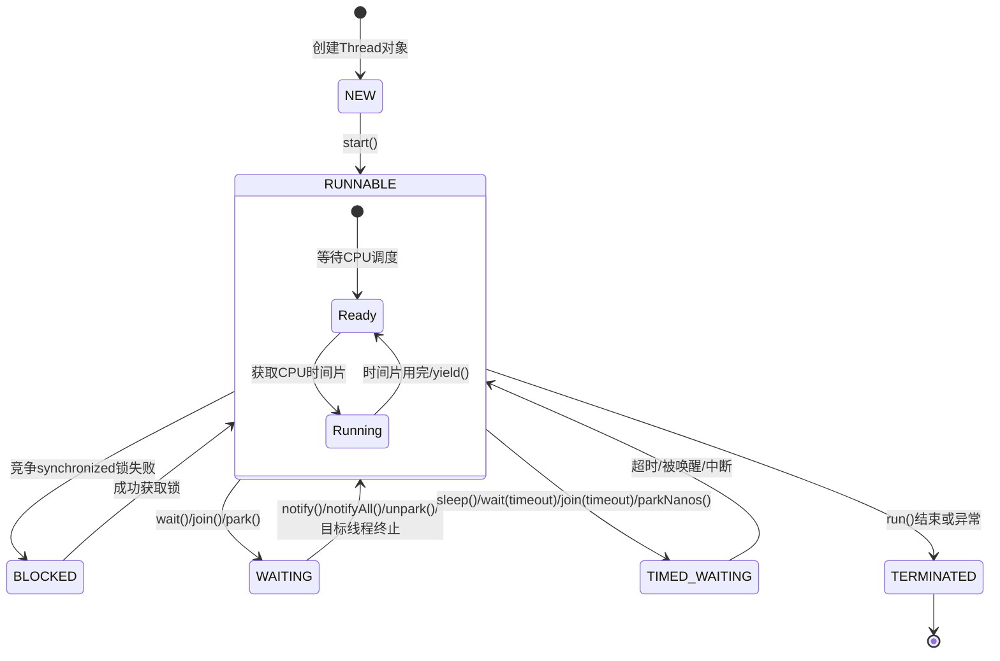

# 操作系统线程五态模型

操作系统将线程状态划分为五类：

![[attachments/Pasted image 20250414150711.png]]

- **New 初始状态**：线程刚被创建，尚未分配资源（如内存、PCB等）
- **Ready 就绪状态**：线程已获得除CPU外的所有资源，等待调度器分配CPU时间片。
- **Running 运行状态**：线程正在CPU上执行指令。
- **Waiting 阻塞状态**：线程因等待外部事件（如I/O完成、锁释放、信号量等）被挂起。
- **Terminated 中止状态**：线程执行完毕或异常退出，资源尚未完全回收。

# Java 线程六态模型

Java 线程的 **`Runnable`** 状态涵盖了操作系统线程的​**​Ready（就绪）、Running（运行）​**​，甚至在某些情况下还隐含了​**​Waiting（等待）​**​（如某些I/O操作）。

![[attachments/Pasted image 20250414152339.png]]

---

---
