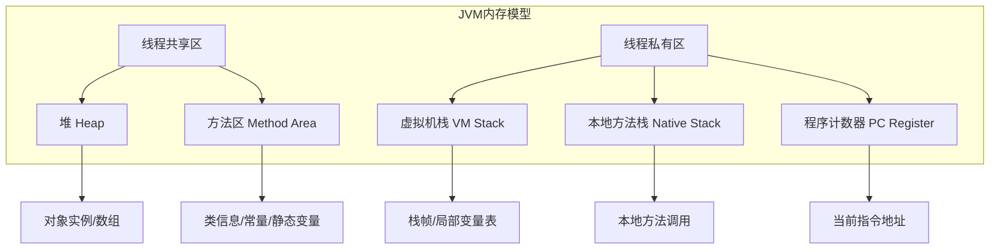

# 1. 栈与栈帧

`JVM` 内存划分为 `方法区`，`堆`，`虚拟机栈`，`本地方法栈`，`程序计数器` 。

---

---

每个线程独立拥有一个`虚拟机栈` 和 `程序计数器`，虚拟机栈中存放`栈帧`, 线程中每个方法调用对应其栈帧入栈，方法调用结束对应其栈帧出栈。

![[attachments/Pasted image 20250414104330.png]]

# 2. 线程上下文切换

多线程并发执行时，由于某些情况，CPU从一个线程切换到另一个线程。切换过程中需要存储当前线程的状态，并加载新线程的状态。

线程上下文切换时的需要保存的`执行状态` 包含**程序计数器，栈帧信息等等**。

触发线程上下文切换的情况有：

- CPU 时间片用完
- 垃圾回收
- 高优先级线程执行
- 线程调用某些方法 sleep，yield，wait, park, synchronized,lock 等

