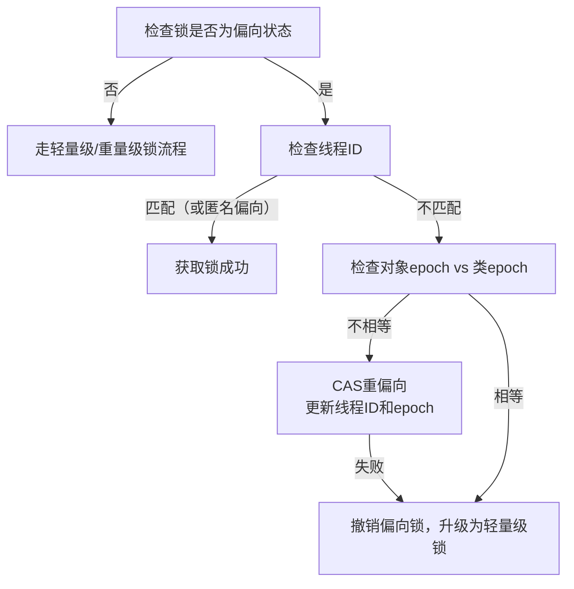

Java `偏向锁` 在 Java 15 被禁用，Java 18 完全移除。

# 偏向锁设计目的

**偏向锁​**​针对​**​完全无竞争​**​的场景（如单线程），消除所有同步开销（轻量级锁的 CAS 操作都没有）。

**偏向锁**仅利用对象头的 `mark word` 进行标识（末尾为01且偏向标记为1），标识锁属于某线程，当该线程获取偏向锁时，只需要检查锁对象偏向的线程是否为自身。如果是，就表示获取了该偏向锁，效率极高。

![[attachments/Pasted image 20250415163247.png]]
# 偏向锁撤销

JVM 默认开启了延迟偏向锁，程序运行4s后创建的对象默认为匿名偏向对象（4s前为普通对象）。

假设 A 线程持偏向锁。线程 B 希望获取锁。此时偏向锁的撤销分为两种情况：

- 1. 线程 A 持有锁期间，线程 B 竞争锁。
- 2. 线程 A 释放偏向锁后，线程 B 获取偏向锁。

情况1出现后，偏向锁无法实现线程同步, JVM 要暂停世界（Stop-The-World）进入**安全点**，确保偏向线程的状态一致。**偏向锁撤销代价高**：要进入 safepoint，会带来 STW 停顿。

情况 2 并未出现锁竞争，但是锁对象偏向不合理，锁对象的`mark word` 会被修改(偏向标记设为0)，此后该锁对象变为`无锁对象`，其偏向锁被撤销，该锁对象使用轻量级锁。

偏向锁撤销后，会被锁对象的类统计次数，当撤销次数达到阈值 20 后，类的 epoch 递增 1，偏向版本改变。
# 偏向锁批量重偏向

JVM 为了优化偏向锁的性能，在后台维护了**撤销计数器**，用于统计某个类的偏向锁撤销次数，并以此为依据决定是否进行批量操作。

偏向锁对象的 epoch 表示其**偏向状态的版本**，类的 epoch 表示该类**偏向锁的全局版本**。当线程尝试获取偏向锁但偏向锁并非偏向当前线程时，会比较两者是否一致：一致表示对象偏向状态仍有效，不可重偏向；不一致则表示对象状态已过期，可以重新偏向当前线程。

第一次触发（批量重偏向）：

- 当**同一个类的对象触发偏向锁撤销达到** **20 次**：
    
    - JVM 会进行一次 **批量重偏向（bulk rebias）**。
        
    - **动作：**
        
        - 类的 **epoch++**，表示更新偏向锁版本。
            
        - 已创建的对象在下次访问时将认为 epoch 失效，从而可以**重新偏向新的线程**。
            
        - 偏向机制仍然启用。

# 偏向锁批量撤销

第二次触发（批量撤销）：

- 如果后续该类的对象又触发了**偏向锁撤销达到** **40 次**（从零重新计数）：
    
    - JVM 将进行 **批量撤销（bulk revoke）**。
        
    - **动作：**
        
        - 类的 epoch++。
            
        - JVM 会为该类设置一个标志：**彻底禁用偏向锁**。
            
        - 后续该类的所有新旧对象都将**不再使用偏向锁**，直接进入轻量级锁或重量级锁的竞争流程。
# 偏向锁加锁流程

