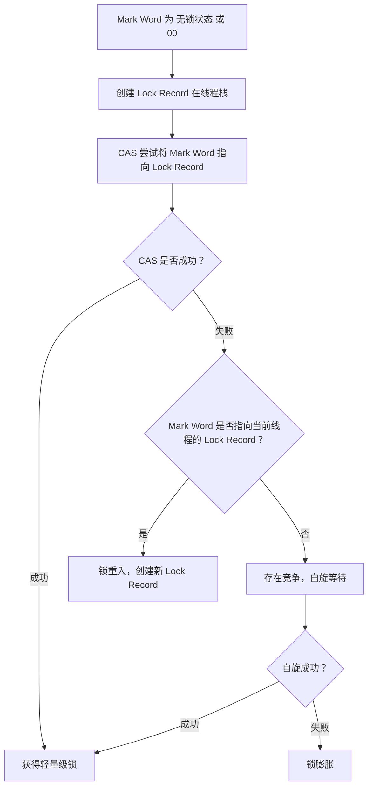
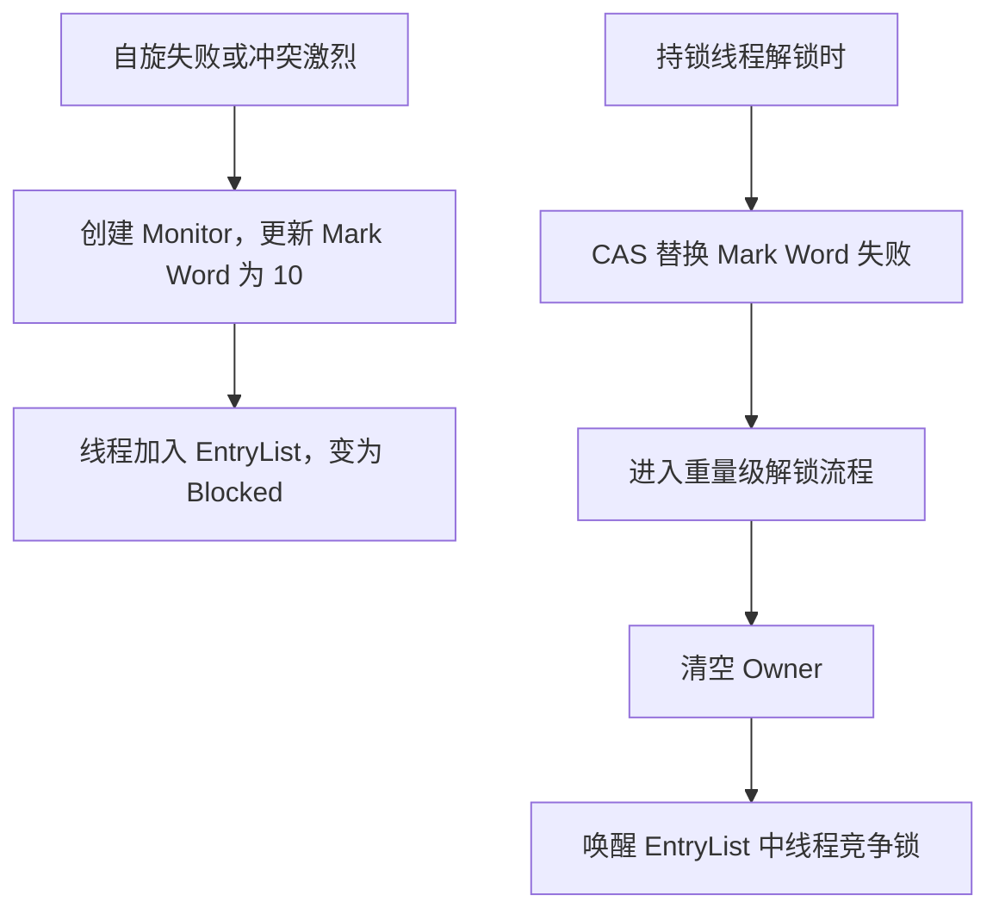

# 设计目的

同步代码块被多个**线程交替执行**，此时**无并发冲突**。依靠**重量级锁​**​（通过操作系统互斥量）会导致操作系统频繁地执行​**​用户态-内核态切换​**​、​**​线程阻塞/唤醒​**​等操作，导致显著开销。

轻量级锁实现依赖**线程虚拟机栈栈帧中的锁记录**和对象头中的`markword`。锁记录保存了**锁记录地址轻量级锁标记 `00`** 和**锁对象引用**。

# 加锁流程

![[attachments/Pasted image 20250415160515.png]]

![[attachments/Pasted image 20250415161125.png]]

![[attachments/Pasted image 20250415161136.png]]

![[attachments/Pasted image 20250415161320.png]]

**轻量级锁加锁流程**:

# 锁膨胀

`锁记录`和对象头 `markword` 执行 `CAS` 操作失败。并且对象头中的 `record lock` 不属于当前栈。当前线程创建 Monitor 管程，更新对象头 mark word，进入管程EntryList，最后变为阻塞状态。

