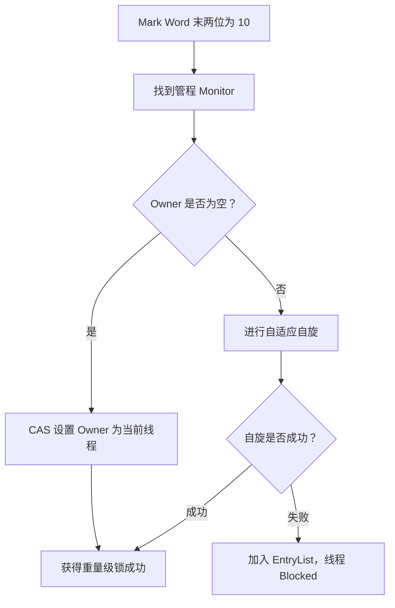

重量级锁的加锁解锁基于 `Monitor` 管程结构(`Owner` `EntryList` `WaitSet`)和对象头的 `mark word`。
>[[线程安全-synchorinized 底层原理]]

# **加锁的流程**

![[attachments/Pasted image 20250415155152.png]]

---

```mermaid
flowchart TD
    A[Mark Word 末两位为 10] --> B[找到管程 Monitor]
    B --> C{Owner 是否为空？}
    C -- 是 --> D[CAS 设置 Owner 为当前线程]
    D --> E[获得重量级锁成功]
    C -- 否 --> F[进行自适应自旋]
    F --> G{自旋是否成功？}
    G -- 成功 --> E
    G -- 失败 --> H[加入 EntryList，线程 Blocked]

```
---
