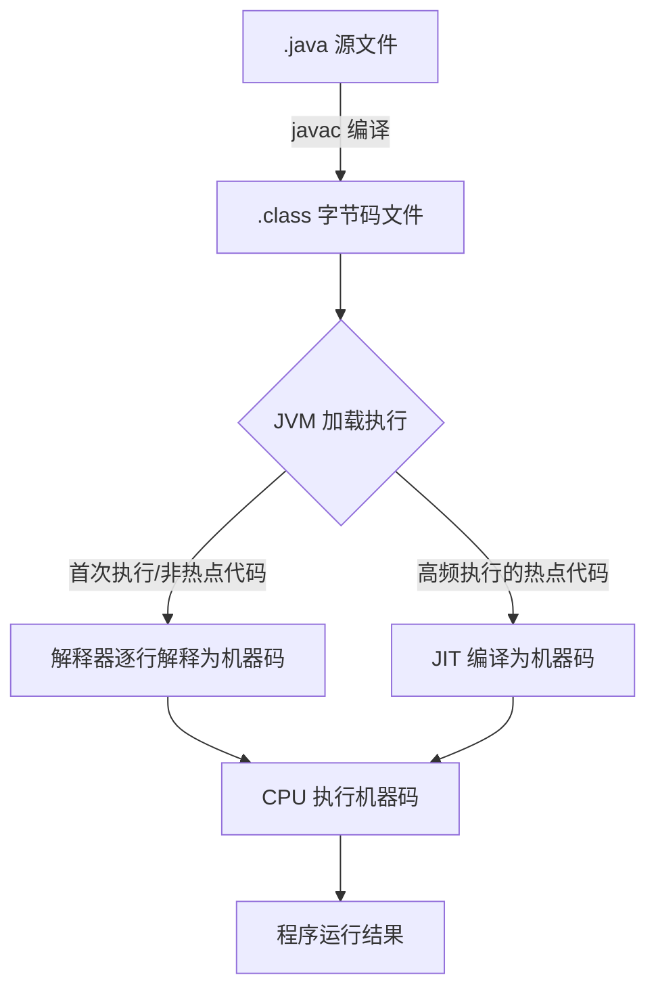
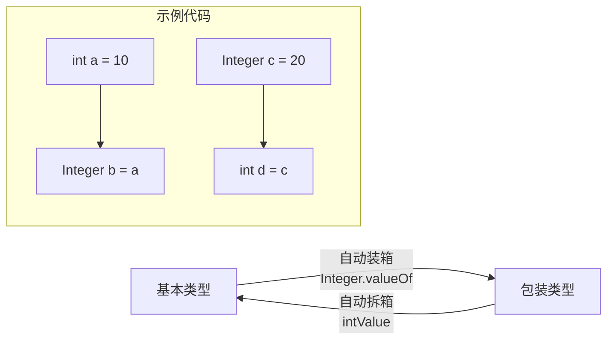
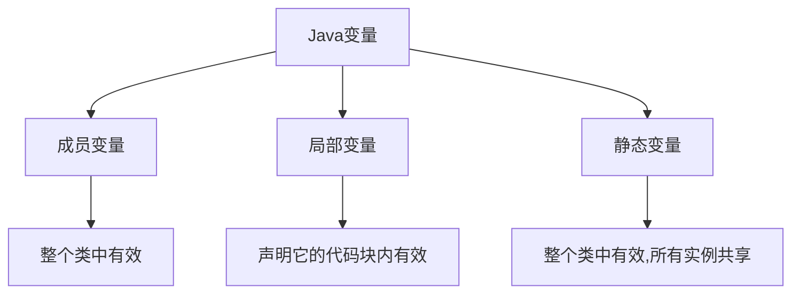

# 1. Java 特点

## 1.1 面向对象

支持**封装、继承、多态**，支持抽象类和接口。

## 1.2 平台无关

基于 JVM 实现一处编译处处运行

## 1.3 强大生态支持

# 2. Java SE 和 Java EE

- Java SE（Java Platform，Standard Edition）: **Java 平台标准版**，Java 编程语言的基础，它包含了支持 Java 应用程序开发和运行的核心类库以及虚拟机等核心组件。Java SE 可以用于构建桌面应用程序或简单的服务器应用程序。
- Java EE（Java Platform, Enterprise Edition ）：**Java 平台企业版**，建立在 Java SE 的基础上，包含了支持企业级应用程序开发和部署的标准和规范（比如 Servlet、JSP、EJB、JDBC、JPA、JTA、JavaMail、JMS）。 Java EE 可以用于构建分布式、可移植、健壮、可伸缩和安全的服务端 Java 应用程序，例如 Web 应用程序。

# 3. JVM、JDK、JRE

JDK 9 以后不再区分 JDK 和 JRE，取而代之的是模块系统和 jlink 工具。JDK 11 开始不再提供单独 JRE 下载。

## 3.1 JVM Java 虚拟机

Java 虚拟机（Java Virtual Machine, JVM）是运行 Java 字节码（ `.class` 文件）的虚拟机。JVM 有针对不同系统的特定实现（Windows，Linux，macOS），目的是使用相同的字节码，它们都会给出相同的结果。

## 3.2 JDK 

JDK（Java Development Kit）是一个功能齐全的 **Java 开发工具包**，供开发者使用，用于创建和编译 Java 程序。它包含了 JRE（Java Runtime Environment），以及编译器 javac 和其他工具，如 javadoc（文档生成器）、jdb（调试器）、jconsole（监控工具）、javap（反编译工具）等。
![[attachments/Pasted image 20250410135456.png]]

## 3.3 JRE

 JRE（Java Runtime Environment）包含 JVM 和 Java 基础类库。

# 4 字节码

`.java` 程序通过开发工具`javac` 编译后变为`.class`字节码文件。`.class` 文件通过 JVM 解释器或者 `JIT 即时编译器` 转化为机器码被执行。


# 5. 如何理解 Java 程序“解释和编译并存”？

高级语言按照程序执行方式可以划分为**编译执行和解释执行**两类。
1. 编译执行：将代码一次编译为指定平台的机器码，平台直接执行机器码。
2. 解释执行：代码通过解释器逐行解释为机器码后被平台执行。

Java 程序执行流程中先编译为字节码然后 JVM 解释执行。[[#4 字节码]]。

# 6. 什么是 AOT ？

JDK 9 引入了一种新的编译模式 **AOT(Ahead of Time Compilation)**，该模式再 Java 程序执行前将 `.java` 文件直接转化为机器码，属于静态编译。

AOT 优点：启动时间快（没有 JIT 预热），内存占用小，打包体积小。

AOT 缺点：AOT 需在编译期确定所有类，无法处理运行时新增的 `.class` 文件。无法支持 Java 的一些动态特性。

## 7. 注释形式

Java 中的注释有三种：
1. **单行注释**：通常用于解释方法内某单行代码的作用。
2. **多行注释**：通常用于解释一段代码的作用。
3. **文档注释**：通常用于生成 Java 开发文档。

# 8. 标识符和关键字

**标识符**就是程序、类、变量、方法的名字。**关键字**是被赋予特殊含义的标识符，比如方法访问修饰符等。

***`true`, `false`, 和 `null` 看起来像关键字但实际上他们是字面值，同时你也不可以作为标识符来使用。***

# 9. 移位操作符

Java 中有三种移位运算符：

- `<<` :左移运算符，向左移若干位，高位丢弃，低位补零。`x << n`,相当于 x 乘以 2 的 n 次方(不溢出的情况下)。
- `>>` :带符号右移，向右移若干位，高位补符号位，低位丢弃。正数高位补 0,负数高位补 1。`x >> n`,相当于 x 除以 2 的 n 次方。
- `>>>` :无符号右移，忽略符号位，空位都以 0 补齐。

## **移位的位数超过数值所占有的位数**

当 int 类型左移/右移位数大于等于 32 位操作时，会先求余（%）后再进行左移/右移操作。也就是说左移/右移 32 位相当于不进行移位操作（32%32=0），左移/右移 42 位相当于左移/右移 10 位（42%32=10）。当 long 类型进行左移/右移操作时，由于 long 对应的二进制是 64 位，因此求余操作的基数也变成了 64。

# 10. continue、break 和 reture 区别
循环中：

1. `continue`：指跳出当前的这一次循环，继续下一次循环。
2. `break`：指跳出整个循环体，继续执行循环下面的语句。

`return` 用于跳出所在方法，结束该方法的运行。return 一般有两种用法：

1. `return;`：直接使用 return 结束方法执行，用于没有返回值函数的方法
2. `return value;`：return 一个特定值，用于有返回值函数的方法

# 11. 基本数据类型

| 类型        | 位数  | 字节数   | 默认值        | 取值范围（或范围描述）                                                           |
| --------- | --- | ----- | ---------- | --------------------------------------------------------------------- |
| `byte`    | 8   | 1     | `0`        | -128 ~ 127                                                            |
| `short`   | 16  | 2     | `0`        | -32,768 ~ 32,767 （-2¹⁵ ~ 2¹⁵-1）                                       |
| `int`     | 32  | 4     | `0`        | -2,147,483,648 ~ 2,147,483,647 （-2³¹ ~ 2³¹-1）                         |
| `long`    | 64  | 8     | `0L`       | -9,223,372,036,854,775,808 ~ 9,223,372,036,854,775,807 （-2⁶³ ~ 2⁶³-1） |
| `char`    | 16  | 2     | `'\u0000'` | 0 ~ 65,535 （0 ~ 2¹⁶-1，表示 Unicode 字符）                                  |
| `float`   | 32  | 4     | `0.0f`     | 约 ±1.4E-45 ~ 3.4028235E38 （IEEE 754 单精度）                              |
| `double`  | 64  | 8     | `0.0d`     | 约 ±4.9E-324 ~ 1.7976931348623157E308 （IEEE 754 双精度）                   |
| `boolean` | 1*  | 无明确大小 | `false`    | `true` 或 `false` （JVM 实现依赖，通常用 1 位存储）                                 |

**注意：**

1. Java 里使用 `long` 类型的数据一定要在数值后面加上 **L**，否则将作为整型解析。
2. Java 里使用 `float` 类型的数据一定要在数值后面加上 **f 或 F**，否则将无法通过编译。

# 12. 包装类型

八种基本类型都有对应的包装类分别为：`Byte`、`Short`、`Integer`、`Long`、`Float`、`Double`、`Character`、`Boolean`。

## 12.1 包装类型的缓存机制

`Byte`,`Short`,`Integer`,`Long` 这 4 种包装类默认创建了数值 **[-128，127]** 的相应类型的缓存数据，`Character` 创建了数值在 **[0,127]** 范围的缓存数据，`Boolean` 直接返回 `TRUE` or `FALSE`

对某数值使用装箱时，如果值的范围再包装类缓存值之间，会复用缓存对象。**包装类型比较**调用`equals()`方法。
```Java
Integer i1 = 40; // 复用缓存对象
Integer i2 = new Integer(40); // 创建新的对象
System.out.println(i1==i2); // false
```

## 12.2 自动装箱拆箱

基本数据类型和包装类型互相转化时会发生自动装箱或者自动拆箱。


# 13. 浮点数精度丢失问题

IEEE 754 标准定义了浮点数的计算机存储表示：符号位、指数位和小数位。精度丢失是的根本原因是**二进制无法准确表示十进制小数**。

## 13.1 如何解决浮点数精度丢失

利用 `BigDeceimal` 类精确表示浮点数。
```Java
BigDecimal a = new BigDecimal("1.0");
BigDecimal b = new BigDecimal("1.00");
BigDecimal c = new BigDecimal("0.8");

BigDecimal x = a.subtract(c);
BigDecimal y = b.subtract(c);

System.out.println(x); /* 0.2 */
System.out.println(y); /* 0.20 */
// 比较内容，不是比较值
System.out.println(Objects.equals(x, y)); /* false */
// 比较值相等用相等compareTo，相等返回0
System.out.println(0 == x.compareTo(y)); /* true */
```

## 13.2 超过 long 范围的数如何表示？

利用`BigInteger`类解决。

# 14 变量



## 14.1 变量
1. ​**​增加初始化规则​**​：

- 成员变量/静态变量：自动初始化
- 局部变量：必须手动初始化
- final变量：必须显式初始化

2. ​**​明确存储位置​**​：

- 成员变量 → 堆内存（对象实例）
- 局部变量 → 栈内存（方法调用栈）
- 静态变量 → 方法区（类元数据区）

# 15 字符常量和字符串常量

**字符常量**相当于一个**整型值( ASCII 值)** 可以参加表达式运算; **字符串常量**代表一个**地址值**(该字符串在内存中存放位置)。

# 16 重载和重写

如果多个方法(比如 `StringBuilder` 的构造方法)有相同的名字、不同的参数， 便产生了**重载。**

**重写**发生在运行期，是子类对父类的允许访问的方法的实现过程进行重新编写。子类方法**返回值类型**应比父类方法返回值类型**更小或相等**，**抛出的异常**范围**小于等于父类**，**访问修饰符范围大于等于父类**。

父类方法访问修饰符为 `private/final/static` 则子类就不能重写该方法。

# 17 可变长参数

从 Java5 开始，Java 支持定义可变长参数，所谓可变长参数就是允许在调用方法时传入不定长度的参数。本质被转化为数组处理。