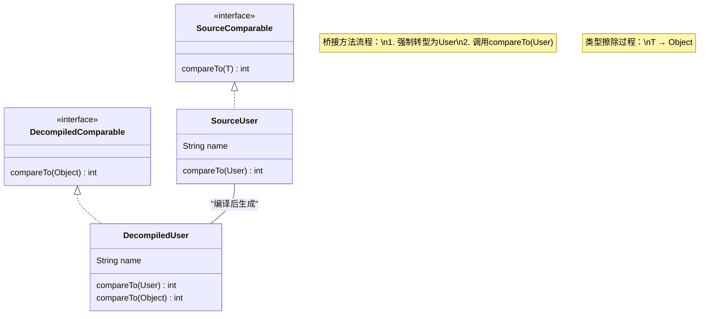

# 1. Java 异常体系

Java 异常类层级结构：

![[attachments/Pasted image 20250413093043.png]]

`Throwable` 类。`Throwable` 类有两个重要的子类:

- **`Exception`** :程序本身可以处理的异常，可以通过 `catch` 来进行捕获。`Exception` 又可以分为 Checked Exception (受检查异常，必须处理) 和 Unchecked Exception (不受检查异常，可以不处理)。
- **`Error`**：`Error` 属于程序无法处理的错误 ，~~我们没办法通过 `catch` 来进行捕获~~不建议通过`catch`捕获 。例如 Java 虚拟机运行错误（`Virtual MachineError`）、虚拟机内存不够错误(`OutOfMemoryError`)、类定义错误（`NoClassDefFoundError`）等 。这些异常发生时，Java 虚拟机（JVM）一般会选择线程终止。

# 2. Exception 异常

Exception 划分为 **Checked Exception 和 UnChecked Exception** 两类。除了 RuntimeException 及其子类是 Unchecked Exception 外，其余 Exception 及其子类都是 Checked Exception。

受检查异常在必须显示处理，否则无法编译。不受检查异常即使不处理也不会导致编译错误。

## 2.1 无需关闭资源的异常处理 `try-catch-finally`

```Java
try {
    System.out.println("Try to do something");
    throw new RuntimeException("RuntimeException");
    return 1;
} catch (Exception e) {
    System.out.println("Catch Exception -> " + e.getMessage());
} finally {
    System.out.println("Finally");
}
```

`finally` 的实现原理是将 `try` `catch` 块中 return 方法返回值存储到临时变量，当执行完 `finally` 块后返回该变量值。**需要注意**：不建议在 finally 中使用 return，因为该块中的 return 值会覆盖原有数据。

程序正常执行，finally 中语句一定执行。出现以下状况，finally 不会执行：

-  finally 之前虚拟机被终止运行
- 程序所在的线程死亡
- 关闭 CPU

## 2.2 需要关闭资源的异常处理 `try-with-resources

Java 7 之后

```Java
try(InputStream inputStream = new FileInputStream(new File(""))) {  
    System.out.println("进入 try");  
    return 1;  
} catch (IOException e) {  
    e.printStackTrace();  
    return 2;  
} finally {  
    System.out.println("进入 finally");  
}
```

***使用要求***：资源必须实现 `java.lang.AutoCloseable` `java.io.Closeable` 接口之一。
***执行顺序***：资源的关闭在任何 catch 和 finally 块语句之前。

# 3. 泛型

JDK 5 引入泛型。泛型本质就是参数化类型，即**类型参数**，当代码逻辑忽略数据类型时使用，比如集合。

泛型有三种使用方式：

- 泛型接口
- 泛型类
- 泛型方法

## 3.1 泛型的三种使用方式

### 3.1.1 泛型接口

```Java
public interface Generator<T> {
    public T method();
}
```

### 3.1.2 泛型类

```Java
public class Generic<T>{

    private T key;

    public Generic(T key) {
        this.key = key;
    }

    public T getKey(){
        return key;
    }
}
```

### 3.1.3 泛型方法

```Java
   public class Generic<T>{

    private T key;

    public Generic(T key) {
        this.key = key;
    }

    public T getKey(){
        return key;
    }
    
    // 泛型方法在方法返回值之前使用 <> 标记为泛型方法
	public static <E> void printArray( E[] inputArray ){
         for ( E element : inputArray ){
            System.out.printf( "%s ", element );
         }
         System.out.println();
    }
}
```

## 3.2 确定泛型的时机

**编译时**泛型的不同使用方式对应了泛型不同的确认时机。编译后泛型被擦除，运行时没有泛型信息。

| **泛型类型​**​ | ​**​定义位置​**​ | ​**​泛型确定时机​**​      | ​**​示例场景​**​                                                                                       |
| ---------- | ------------ | ------------------- | -------------------------------------------------------------------------------------------------- |
| 泛型接口       | 接口声明         | 实现类指定或实例化时          | 实现接口指定：`class MyList<T> implements List<String>`<br>实例化类时： `class MyList<T> implements List<T>` >` |
| 泛型类        | 类声明          | 实例化对象时              | `Box<String> box = new Box<>`                                                                      |
| 泛型方法       | 方法声明         | 方法调用时（参数类型推断或显式指 定） | `String s = getFirst(stringList)`                                                                  |

## 3.3 泛型继承

某类**继承泛型类**或者**实现泛型接口**时，该类可以指定父类/接口的泛型，也可以继承父类/接口的泛型，还可以拓展自己的泛型。

```Java
interface GenericInterface<T, V>{  
    T test(T t);  
    void test (T t, V v);  
}

// 继承接口泛型并且指定了接口泛型同时还拓展泛型。
class GenericClass<T, V, N> implements GenericInterface<T, Integer>{  
    @Override  
    public T test(T t) {  
        return null;  
    }  
  
    @Override  
    public void test(T t, Integer integer) {  
  
    }  
}
```

## 3.4 泛型基本原理：类型擦除

泛型本质是类型参数，从 `.java` 文件使用 `javac` 编译器编译为 `.class` 文件后，类型被擦除，运行时没有泛型信息。泛型仅仅对编译器可见。

类型擦除的[原理](https://www.cnblogs.com/robothy/p/13949788.html)：

>Java 编译器通过如下方式实现擦除：
>
>- 用 **Object 或者界定类型替代泛型**，产生的字节码中只包含了原始的类，接口和方法；
>- 在恰当的位置插入**强制转换**代码来确保类型安全；
>- 在继承了泛型类或接口的类中插入**桥接方法**来保留多态性。

举例说明：User 类实现 Comparable 接口并实现方法 `compareTo()`。同时，将编译后的文件反编译，比较反编译后结果说明类型擦除。

-  ***源码*** 

	```Java
	public interface Comparable<T>{ int compareTo(T o); }
	```

	```Java
	class User implements Comparable<User> {  
	    String name;  
	      
	    @Override  
	    public int compareTo(User other){  
	        return this.name.compareTo(other.name);  
	    }  
	}
	```

- ***反编译*** 
 
	```Java
	// Decompiled by Jad v1.5.8g. Copyright 2001 Pavel Kouznetsov. 
	// Jad home page: http://www.kpdus.com/jad.html
	// Decompiler options: packimports(3) 
	// Source File Name: Comparable.java 
	package java.lang; 
	// Referenced classes of package java.lang: 
	// Object 
	public interface Comparable { 
		public abstract int compareTo(Object obj); 
	}
	```

	```Java
	// Decompiled by Jad v1.5.8g. Copyright 2001 Pavel Kouznetsov. 
	// Jad home page: http://www.kpdus.com/jad.html 
	// Decompiler options: packimports(3) 
	// Source File Name: User.java
	class User implements Comparable { 
		User() { }
		 
		public int compareTo(User user) { 
			return name.compareTo(user.name); 
		} 
		
		// 桥接方法 
		public volatile int compareTo(Object obj) { 
			return compareTo((User)obj); 
		} 
		
		String name; 
	}
	```

***实验结果：***

- **替代泛型**：Comparable 接口定义的泛型 T 被替换为 Object
- **强制转换**：编译后 User 类多出的桥接方法中出现了将 Object 类型强转为 User 类型，利用方法重载调用子类 `compareTo()` 方法。
- **桥接方法**：某类继承泛型父类或者实现泛型接口并需要重写方法时，为了满足 **多态特性**，编译时**编译器**自动**添加桥接方法**。

---

---

User 类实现接口 Comparable 。Comparable 源码的方法 `compareTo(T t)` 由于被 Object 替代泛型，变为 `compareTo(Object obj)`。User 类实现该接口，必须实现 `compareTo(Object obj)` 方法，但是 User 源码中仅仅定义了 `compareTo(User user)` ，因此 `javac` 编译器处理时自动在 User 中添加了**桥接方法** `compareTo(Object obj)`。该方法 User 类中的 `compareTo(User user)` 构成方法重载，并将 obj **强制转换为User对象** 后调用了`compareTo(User user)`。

## 3.5 泛型通配符 `?`

泛型通配符分为**无界通配符(?)、上界通配符(? extends T)、下届通配符(? super T)**。通常在处理**泛型集合**使用。

### 3.5.1 `?` **无界通配符

? 代表任意类型。`List<?>`  表示集合中可以存储任意类型，仅仅允许从该集合中获取元素，不允许添加元素（避免集合中同时存在两种及以上类型的数据）
`List<?> list` 该集合中 `list.get()` 被允许，**取出的元素一定为 Object 类型**。~~`list.add("1"), list.add(Integer.valueOf(1))`~~ 任何添加操作不被允许。

```Java
public void printList(List<?> list) {
    for (Object elem : list) {
        System.out.println(elem);
    }
}

// 可以接受任何类型的List
List<Integer> intList = Arrays.asList(1, 2, 3);
List<String> strList = Arrays.asList("a", "b", "c");
printList(intList);
printList(strList);
```

### 3.5.2 `? extends T` 上界通配符

表示 T 类型及其子类型。可以**安全读**，取出的类型一定为 T 。不允许写，因为可能写入不同类型导致可能出现 T 子类强转类型时异常。

```Java
public double sumOfList(List<? extends Number> list) {
    double sum = 0.0;
    for (Number num : list) {
        sum += num.doubleValue();
    }
    return sum;
}

List<Integer> intList = Arrays.asList(1, 2, 3);
List<Double> doubleList = Arrays.asList(1.1, 2.2, 3.3);
System.out.println(sumOfList(intList));    // 6.0
System.out.println(sumOfList(doubleList)); // 6.6
```

### 3.5.3 `? super T` 下界通配符

表示 T 类型及其父类型。可以**安全写入 T 及其 子类**，读取数据时返回顶级父类 `Object` 类型。

```Java
public void addNumbers(List<? super Integer> list) {
    for (int i = 1; i <= 5; i++) {
        list.add(i);
    }
}

List<Number> numList = new ArrayList<>();
List<Object> objList = new ArrayList<>();
addNumbers(numList); // 可以，Number是Integer的父类
addNumbers(objList); // 可以，Object是Integer的父类
```

## 3.6 PECS 原则 `Producer-Extends, Consumer-Super`

上界通配符的 `安全读` 特性可以作为消费者。下界通配符 `安全写` 特性，可以作为消费者，写入数据。

```Java
public static void copy(List<? extends Number> src, List<? super Number> dest) {  
    for (Number number : src) { // 安全读取  
        dest.add(number); // 安全写子类（多态特性）  
    }  
}  
  
public static void main(String[] args) {  
    List<Integer> intList = Arrays.asList(1, 2, 3);  
    List<Number> numList = new ArrayList<>();  
    copy(intList, numList); // 正确使用PECS原则  
    System.out.println(numList);  
}
```

```Java
// T 必须时 Comparable 的实现类，Comparable<? super T> 限定 T 可以自己实现方法，也可以是其父类实现方法，T 继承。
// <T extends Comparable<T>> 不推荐
public static <T extends Comparable<? super T>> T max(List<? extends T> list) {
    if (list.isEmpty()) throw new IllegalArgumentException("Empty list");
    T max = list.get(0);
    for (T item : list) {
        if (item.compareTo(max) > 0) {
            max = item;
        }
    }
    return max;
}
```

# 4. 反射

反射能够在**程序运行时**利用**方法区**中的 **`Class`** 对象获取类信息并**动态操作类或者对象**。

## 4.1 反射实现机制

**底层实现机制​**​：

- JVM为每个加载的类创建一个`Class`对象，包含类的结构信息(方法、字段、构造器等)
- 这些`Class`对象存储在方法区，是反射操作的基础
- 反射API通过访问这些`Class`对象来获取类的元数据

**获取 Class 对象三种方式**

```Java
// 获取Class对象的三种方式
Class<?> clazz1 = String.class;          // 通过类字面量
Class<?> clazz2 = "hello".getClass();    // 通过对象实例
Class<?> clazz3 = Class.forName("java.lang.String"); // 通过全限定类名
```

## 4.2 关键类 `Class` `Field` `Method` `Constructor`

# 5. Java 注解

用于修饰类、方法或者变量，提供某些信息供程序在编译或者运行时使用。

注解只有被解析之后才会生效，常见的解析方法有两种：

- **编译期直接扫描**：编译器在编译 Java 代码的时候扫描对应的注解并处理，比如某个方法使用`@Override` 注解，编译器在编译的时候就会检测当前的方法是否重写了父类对应的方法。
- **运行期通过反射处理**：像框架中自带的注解(比如 Spring 框架的 `@Value`、`@Component`)都是通过反射来进行处理的。

# 6. `SPI` 服务提供接口

Java SPI (Service Provider Interface) 是一种服务发现机制，允许第三方为接口提供实现，并在运行时动态加载这些实现。

服务调用方和服务实现者**解耦**，能够提升程序的扩展性、可维护性。但是，需要遍历加载所有的实现类，不能做到按需加载，这样效率还是相对较低。
## 6.1 核心概念

1. ​**​服务接口(Service Interface)​**​: 定义需要被实现的功能接口
2. ​**​服务提供者(Service Provider)​**​: 实现服务接口的具体类
3. ​**​服务加载器(ServiceLoader)​**​: Java提供的用于加载服务实现的工具类

# 7. 序列化和反序列化

**序列化**将数据结构或**对象**状态转换成**可取用格式**，**反序列化**将**可取用格式**转化为**对象**或者数据结构。

## 7.1 JDK 自带序列化方式

要求实现 `java.io.Serializable`接口，利用序列化号 `serialVersionUID` 进行版本控制，反序列化`serialVersionUID` 不一致会抛出`InvalidClassException` 异常。`serialVersionUID` 只是用来被 JVM 识别，实际并没有被序列化。

对于不想进行序列化的变量，可以使用 `transient` 关键字修饰。


