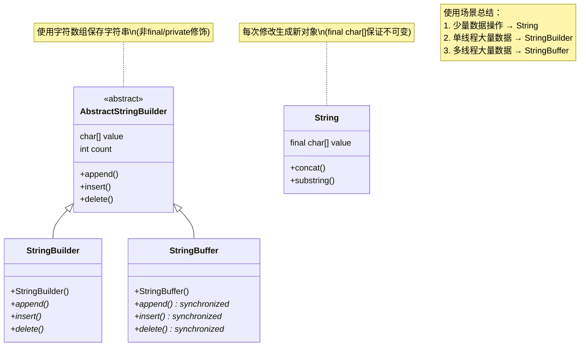

# 1. 编程范式：面向对象和面向过程区别

面向过程编程（Procedural-Oriented Programming，POP）和面向对象编程（Object-Oriented Programming，OOP）是两种常见的编程范式。

面向过程通过方法组合解决问题，面向对象先抽象出对象，调用对象方法解决问题。

编程范式并不影响性能，性能取决于编程语言的运行机制。

# 2. 对象实体和对象引用

使用 `new` 创建类的对象实体并存储再堆中，对象引用指向了对象实体。对象引用唯一指向一个对象实例，一个对象实例能够被多个引用所指。

对象引用的存储位置取决于对象引用的变量类型(静态变量、成员变量、局部变量)。对象实例存储再堆中。

对象引用 a，b相等说明 a、b 指向了相同对象，对象相等指的是堆中对象实例相等。

# 3. 面向对象三大特征

**封装、继承、多态**。

## 3.1 封装

隐藏对象属性，仅仅对外暴露方法操作这些属性。

## 3.2 继承

子类继承父类的属性和方法，子类能够访问和重写父类允许被访问和重写的方法。Java 为单继承机制，但允许类实现多个接口，接口继承多个接口。

## 3.3 多态

父类的引用指向子类实例。程序运行时先找子类实例的重写方法，如果没有则执行父类方法。

# 4. 抽象类和接口共同点和区别

共同点：
1. 无法实例化
2. 定义抽象方法

区别：
1. 设计目的：接口约束实现类的行为，抽象类强调继承类的复用
2. 变量：接口成员变量只能 `public static final` 类型。抽象类随意。
3. 方法：接口在 Java8 允许定义  `default`（默认） 方法和 `static` （静态）方法,Java 9 起，接口可以包含 `private` 方法。抽象类不限制。

# 5. 深拷贝和浅拷贝

要求实现接口 `Cloneable`。

- **浅拷贝**：浅拷贝会在堆上创建一个新的对象（区别于引用拷贝的一点），拷贝引用。
- **深拷贝**：深拷贝会完全复制整个对象，包括这个对象所包含的内部对象。

直接调用 Object 的 `clone()` 时仅仅实现**浅克隆**，**重写`clone`方法实现深克隆**。

# 6. Object

## 6.1 Object 常用方法

```Java
/**
 * native 方法，用于返回当前运行时对象的 Class 对象，使用了 final 关键字修饰，故不允许子类重写。
 */
public final native Class<?> getClass()
/**
 * native 方法，用于返回对象的哈希码，主要使用在哈希表中，比如 JDK 中的HashMap。
 */
public native int hashCode()
/**
 * 用于比较 2 个对象的内存地址是否相等，String 类对该方法进行了重写以用于比较字符串的值是否相等。
 */
public boolean equals(Object obj)
/**
 * native 方法，用于创建并返回当前对象的一份拷贝。
 */
protected native Object clone() throws CloneNotSupportedException
/**
 * 返回类的名字实例的哈希码的 16 进制的字符串。建议 Object 所有的子类都重写这个方法。
 */
public String toString()
/**
 * native 方法，并且不能重写。唤醒一个在此对象监视器上等待的线程(监视器相当于就是锁的概念)。如果有多个线程在等待只会任意唤醒一个。
 */
public final native void notify()
/**
 * native 方法，并且不能重写。跟 notify 一样，唯一的区别就是会唤醒在此对象监视器上等待的所有线程，而不是一个线程。
 */
public final native void notifyAll()
/**
 * native方法，并且不能重写。暂停线程的执行。注意：sleep 方法没有释放锁，而 wait 方法释放了锁 ，timeout 是等待时间。
 */
public final native void wait(long timeout) throws InterruptedException
/**
 * 多了 nanos 参数，这个参数表示额外时间（以纳秒为单位，范围是 0-999999）。 所以超时的时间还需要加上 nanos 纳秒。。
 */
public final void wait(long timeout, int nanos) throws InterruptedException
/**
 * 跟之前的2个wait方法一样，只不过该方法一直等待，没有超时时间这个概念
 */
public final void wait() throws InterruptedException
/**
 * 实例被垃圾回收器回收的时候触发的操作
 */
protected void finalize() throws Throwable { }
```

## 6.2 == 和 equals() 区别

**`==`** 对于基本类型和引用类型的作用效果是不同的：

- 对于基本数据类型来说，`==` 比较的是值。
- 对于引用数据类型来说，`==` 比较的是对象的内存地址。

`equals()` 方法存在两种使用情况：

- **类没有重写 `equals()`方法**：通过`equals()`比较该类的两个对象时，调用 Object的 equals 方法，比较引用。
- **类重写了 `equals()`方法**：一般我们都重写 `equals()`方法来比较两个对象中的属性是否相等；若它们的属性相等，则返回 true(即，认为这两个对象相等)。

# 6.3 hashCode() 用途

计算对象的散列值并返回。可能产生 hash 冲突。结合 `equals` 判断对象是否相同。
Java 要求：​**​如果两个对象相等（`equals()` 返回 `true`），它们的 `hashCode()` 必须相同​**​。因此重写了 equals 方法，必须重写 hashCode 方法。

**hashCode 不同，对象一定不同，hashCod 相同，对象不一定相同（hash 冲突），需要进一步通过 equals 判断对象是否相同。**


# 7 String、StringBuffer、StringBuilder区别




String 不可变。

`StringBuilder` 与 `StringBuffer` 都继承自 `AbstractStringBuilder` 类，在 `AbstractStringBuilder` 中也是使用**字符数组保存字符串**（没有使用 `final` 和 `private` 关键字修饰）。

每次对 `String` 类型进行改变的时候，都会生成一个新的 `String` 对象，然后将指针指向新的 `String` 对象。

**对于三者使用的总结：**

- 操作少量的数据: 适用 `String`
- 单线程操作字符串缓冲区下操作大量数据: 适用 `StringBuilder`
- 多线程操作字符串缓冲区下操作大量数据: 适用 `StringBuffer`

# 8. String 为什么不可变

```Java
// Java 8
public final class String implements java.io.Serializable, Comparable<String>, CharSequence {
    private final char value[];
  //...
}
```

private final 修饰字符数组，同时并未暴露修改数组的方法，同时也不允许 String 类被继承，不可能被子类破坏。

## 8.1 字符串拼接 `+` 和 `StringBuilder`

Java 8 中字符串对象通过“+”的字符串拼接方式，实际上是通过**创建`StringBuilder` 对象**并调用 `append()` 方法实现的，拼接完成之后调用 `toString()` 得到一个 `String` 对象 。

```Java
String[] arr = {"he", "llo", "world"};
String s = "";
for (int i = 0; i < arr.length; i++) {
    s += arr[i]; // 性能非常差！多次创建 StringBuilder 对象
}
System.out.println(s);
```

# 9. 字符串常量池

**字符串常量池** 是 JVM 为了提升性能和减少内存消耗针对字符串（String 类）专门开辟的一块区域，主要目的是**为了避免字符串的重复创建。**

## 9.1 字符串创建流程。new String("abc") 创建了几个对象

关键在于字符串常量池里是否包含 ”abc“。
```Java
String s1 = "abc";  // 常量池新建 "abc"（1对象）
String s2 = "abc";  // 复用常量池的 "abc"（0新对象）
System.out.println(s1 == s2); // true（引用相同）
```

```Java
String s3 = new String("abc"); // 2个对象：
                              // 1. 常量池的 "abc"（若不存在）
                              // 2. 堆中新建的 String 对象
```

## 9.2 String 实例的 `intern` 方法

```Java
String s = "abc".intern();
```

重点在于字符串常量池是否有 ”abc“ 对象，如果有，该方法返回该对象的引用，反之，将 "abc" 添加到字符串常量池并返回引用。

## 9.3 String 类型变量和常量使用 `+` 拼接

```Java
String str1 = "str";
String str2 = "ing";
String str3 = "str" + "ing";
String str4 = str1 + str2;
String str5 = "string";
System.out.println(str3 == str4);//false
System.out.println(str3 == str5);//true
System.out.println(str4 == str5);//false
```

字符串**常量拼接**会被 `javac` 编译器优化（**`常量折叠(Constant Folding)`**），字符串**变量拼接**先创建 `StringBuilder` 对象然后调用 `append` 和 `toString()` 方法创建 `String` 对象后返回。

