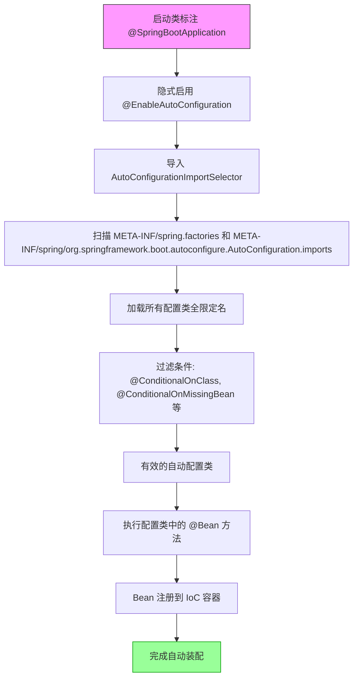

`SpringBoot` 定义了一套规范，`SpringBoot` 程序启动时能够根据该规范自动地从实现了该规范的 Starter 中读取配置类并加载该配置类中的 Bean 到 `IoC` 容器。

# 自动装配流程

# Spring Boot Stater

Spring Boot Starter 是依赖管理工具，将库和配置打包。

例如 `spring-boot-starter-web` 包含了构建 Web 应用程序需要的 Spring MVC、Tomcat（默认嵌入式服务器）、Jackson（JSON 库）等依赖，不需要我们手动添加和配置。​