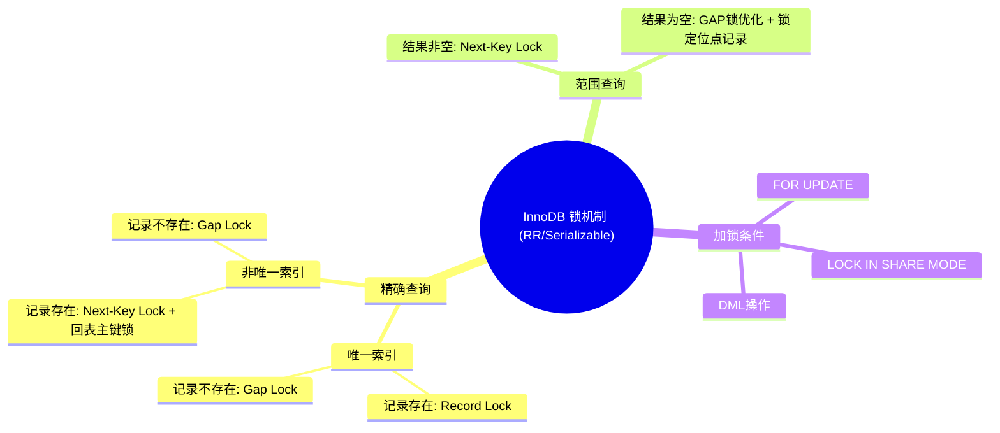

InnoDB 基于索引组织表数据[[Index-索引分类]]。**行级锁**基于索引项（B+ 树叶子节点）实现，并非基于记录实现。行锁主要分为三类：**行锁、间隙锁和临键锁**。

# 行级锁分类

1. **记录锁（Record Lock）**：锁定记录，支持的**隔离级别 RR，RC 。**
	![[attachments/Pasted image 20250409153628.png]]
2. **间隙锁（Gap Lock）**：锁定 B+ 树中升序叶子节点的索引值间隙（以聚集索引为例）。锁住间隙可以防止事务查询数据时其他事务插入数据导致出现`幻读`。支持的**隔离级别 RR**。(a,b).
	![[attachments/Pasted image 20250409154043.png]]
3. **临键锁（Next-Key Lock）**：组合 `行锁` 和`间隙锁`同时**锁某行和改行之前所有间隙**。(a,b]。
	![[attachments/Pasted image 20250409154612.png]]

## 记录锁（Record Lock）

MySQL 中使用`REC_NOT_GAP`表示记录锁。`S REC_NOT_GAP` `X REC_NOT_GAP`分别表示共享记录锁，排他记录锁。

记录锁分为两种类型：
1. 共享锁 S：确保读一致性。某记录的共享锁可以被多个事务同时持有，与排他锁互斥。
2. 排他锁 X：与 S 锁和 X锁互斥。允许更新内容。

在 `Repeatable Read` 隔离级别下，执行 `DML` 语句会给相关记录加 X 锁，`select ... lock in share mode` 会给相关记录加 S 锁，具体如下：

![[attachments/Pasted image 20250416100647.png]]

## 间隙锁（GAP）

MySQL 中使用`REC_NOT_GAP`表示记录锁。` S GAP` `X GAP`分别表示共享间隙锁，排他间隙锁。

假设 a, b 为真实的索引边界。间隙锁锁定的范围不包含边界，即锁定（a,b）。

## 临键锁（ **Next-Key Lock**）

MySQL 中使用单独的 `S` 或者 `X` 表示记录锁。`S` `X`分别表示共享临键锁，排他临键锁。

假设 a, b 为真实的索引边界。间隙锁锁定的范围包含右边界，即锁定（a,b]。

# 行级锁加锁分析

开启行锁要求执行 `DML` 或者显示加锁的`DQL`（使用` FOR UPDATE` 或 `LOCK IN SHARE MODE` 显式加锁）。

`记录锁`（**Record Lock**）是在 **所有隔离级别**中都可能生效。`间隙锁`和`临键锁`在 `RR` 和 `Serializable` 隔离级别下生效。

行锁的加锁情况视查询粒度和索引类型而有所不同。出现`回表`时，可能锁定聚集索引中对应记录。

## 精确查询（等值查询）

### 唯一索引（包含聚集索引）

当通过 唯一索引进行等值查询时。  
如果目标记录存在，InnoDB 会对该记录加 记录锁（Record Lock），用于防止其他事务对该记录进行修改或插入重复键。

如果查询结果为空，则会对目标值应插入的位置的间隙加锁（间隙锁），以防止幻读。

### 普通索引

在非唯一索引精确查询中，  
如果查询结果不为空使用 next-key lock 锁定索引项（索引和对应主键），并锁定末尾间隙防止幻读。

如果查询结果为空，则会对目标值应插入的位置的间隙加锁（间隙锁），以防止幻读。
## 范围查询

所有类型的索引（主键、唯一索引、普通索引）都会加上 Next-Key Lock，即锁住索引记录本身以及它前面的间隙 (a, b]，以防止幻读。

如果查询结果为空，依然会在目标区间加锁，只是锁定的索引项是紧邻该区间的下一个存在的数据记录（作为锁定位点），主键索引使用 GAP 间隙锁优化。

查询结果不为空，使用临键锁锁定对应范围，视情况而定。

